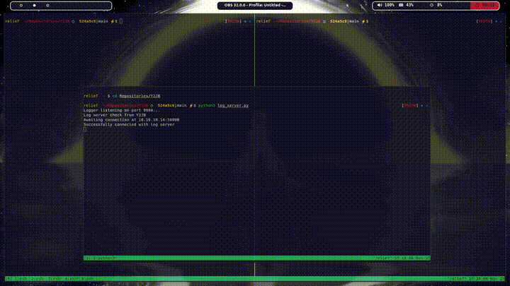

# Y2JB Updater

This project provides a payload and an HTTP server used for updating the Y2JB files on your PlayStation 5 using a local PC. This should help people that do not want to restore a new backup every time a new update is released.

**Credits:**
*   Y2JB Exploit by [Gezine](https://github.com/Gezine/Y2JB)



## Prerequisites

*   **Y2JB Exploit:** A PlayStation 5 running the Y2JB exploit.
*   **`payload_sender.py`:** From the Y2JB repository.

## Setup

1.  **Clone the Y2JB Repository:**
    Clone the original Y2JB repository:
    ```bash
    git clone https://github.com/Gezine/Y2JB.git
    ```
    Then, place `update_server.py` and `y2jb_updater.js` into the Y2JB repository. Make sure that the `y2jb_updater.js` is inside the payloads folder, and `update_server.py` is in the root folder of the Y2JB repository. 

    The file structure should look like this:
    ```
    Y2JB/
    ├── update_server.py
    ├── payloads/
    │   └── y2jb_updater.js
    └── download0/
        └── cache/
            └── splash_screen/
                └── aHR0cHM6Ly93d3cueW91dHViZS5jb20vdHY=/
                    ├── main.js
                    └── splash.html
    ```

2.  **Set the HTTP server IP:**
    Open the `y2jb_updater.js` and **change `UPDATE_SERVER_IP`** to your PC's IP address.

## Usage

1.  **Start the Update Server on your PC:**
    ```bash
    python3 update_server.py
    ```

2.  **Send the Updater Payload to your PS5:**
    Once the Youtube APP is already waiting for a payload, send the y2jb_updater.js
    ```bash
    python3 payload_sender.py <PS5_IP> <PS5_PORT> payloads/y2jb_updater.js
    ```

3. **Restart the Youtube APP:**
    Just restart the app, and it will have the updated files.
